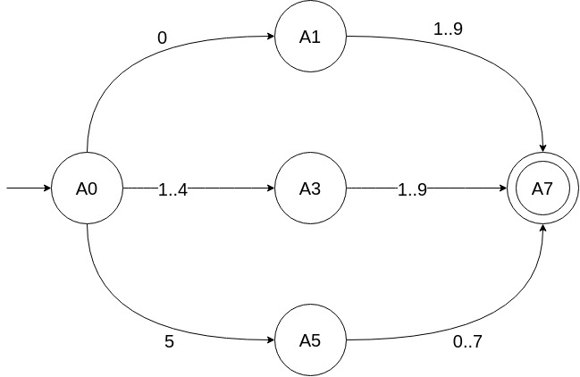
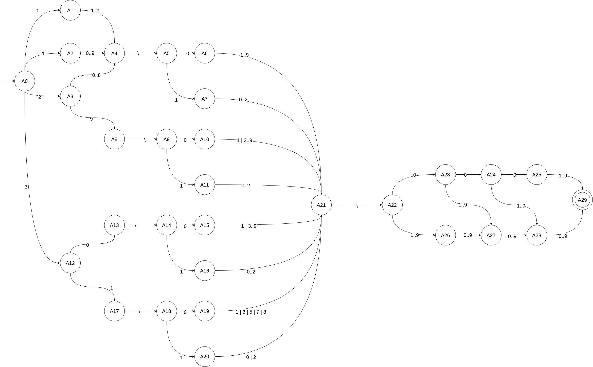
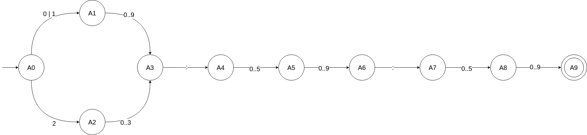

# Simulation d'un automate en Kotlin

Ce projet Kotlin simule un automate fini simple. Il permet de définir des états, des transitions entre eux, et de vérifier si un mot donné est accepté par l'automate.

## Comment lancer le projet ?

Lancez [le .jar](automateDemo.jar) avec la commande `java -jar .\automateDemo.jar`

## Automates par défauts 
(dans `Main.kt`)

Voici les automates disponibles :

- Automate acceptant les nombres de 01 à 57  
  [](src/main/resources/auto_exo7-01-57.jpg)

- Automate acceptant les dates (format JJ/MM/AAAA)  
  [](src/main/resources/auto_exo7-Date.jpg)

- Automate acceptant les heures (HH:MM)  
  [](src/main/resources/auto_exo7-Heure.jpg)

## Classes

### `State`
Cette classe représente un état dans l'automate.

- **Attributs** :
    - `nom` : Nom de l'état.
    - `transitions` : Un dictionnaire de transitions où la clé est un caractère et la valeur est l'état suivant.

- **Fonctions** :
    - `getNom()` : Retourne le nom de l'état.
    - `getTransition()` : Retourne la table des transitions de l'état.
    - `addTransition(c: Char, destination: State)` : Ajoute une transition de cet état vers un autre, basée sur le caractère `c`.

- **Méthode statique** :
    - `createStates(word: String, start: Int, end: Int): MutableList<State>` : Crée une liste d'états avec des noms basés sur `word` et des indices allant de `start` à `end`.

### `Automate`
Cette classe représente l'automate lui-même.

- **Attributs** :
    - `s0` : L'état de départ.
    - `sf` : Un ensemble d'états finaux (états d'acceptation).
    - `alpha` : Un ensemble de caractères (alphabet) reconnu par l'automate.
    - `etats` : Un ensemble de tous les états de l'automate.
    - `delta` : Un dictionnaire des transitions entre les états.

- **Fonctions** :
    - `setStartingState(s0: State)` : Définit l'état de départ de l'automate.
    - `getStartingState()` : Retourne l'état de départ.
    - `addFinalState(s: State)` : Ajoute un état final (d'acceptation).
    - `getFinalStates()` : Retourne l'ensemble des états finaux.
    - `getDeltas()` : Retourne la table des transitions (fonction delta).
    - `addDelta(source: State, c: Char, destination: State)` : Ajoute une transition de `source` à `destination` basée sur le caractère `c`.
    - `addDeltaFromList(source: State, ls: List<Char>, destination: State)` : Ajoute plusieurs transitions de `source` à `destination` basées sur une liste de caractères `ls`.
    - `addDeltaFromString(source: State, exp: String, destination: State)` : Ajoute des transitions basées sur une expression sous forme de chaîne (supporte les intervalles comme `a..z` ou des caractères individuels comme `a | b`).
    - `getAlpha()` : Retourne l'ensemble des caractères de l'alphabet.
    - `getStates()` : Retourne l'ensemble de tous les états.
    - `getNom()` : Retourne le nom de l'automate.
    - `DoYouAccept(word: String, debug_Output: Boolean = true): Boolean` : Vérifie si l'automate accepte un mot donné et affiche les étapes de transition si `debug_Output` est défini à `true`.

## Exemple

L'exemple suivant montre comment créer un automate qui n'accepte que les nombre de 01 (inclus) à 57 (inclus), définir des transitions et vérifier si un mot est accepté.

[](src/main/resources/auto_exo7-01-57.jpg)

```kotlin
val Etats_0157 = State.createStates("A", 0, 7)
val Auto_0157 = Automate("01-57")

// Ajout des transitions
Auto_0157.addDeltaFromString(Etats_0157[0], "0", Etats_0157[1])
Auto_0157.addDeltaFromString(Etats_0157[1], "1..9", Etats_0157[7])
Auto_0157.addDeltaFromString(Etats_0157[0], "1..4", Etats_0157[3])
Auto_0157.addDeltaFromString(Etats_0157[3], "0..9", Etats_0157[7])
Auto_0157.addDeltaFromString(Etats_0157[0], "5", Etats_0157[5])
Auto_0157.addDeltaFromString(Etats_0157[5], "0..7", Etats_0157[7])

// Définition de l'état de départ et de l'état final
Auto_0157.setStartingState(Etats_0157[0])
Auto_0157.addFinalState(Etats_0157[7])

// Vérification si un mot est accepté
var isAccepted = Auto_0157.DoYouAccept("111")
println("Mot accepté : $isAccepted") //Mot accepté : false
isAccepted = Auto_0157.DoYouAccept("24")
println("Mot accepté : $isAccepted") //Mot accepté : true
```
Dans cet exemple :
- On crée 8 états (de A0 à A7).
- On définit des transitions pour les caractères entre les états.
- L'automate commence à l'état A0 et accepte le mot lorsqu'il atteint l'état A7.
- Les mots 111 et 24 sont vérifiés pour être acceptés.

## Conclusion

Cet automate basé sur Kotlin permet de modéliser et simuler des systèmes à états avec des transitions entre les états selon des entrées de caractères. La fonction DoYouAccept() évalue si un mot est valide selon les règles de l'automate.